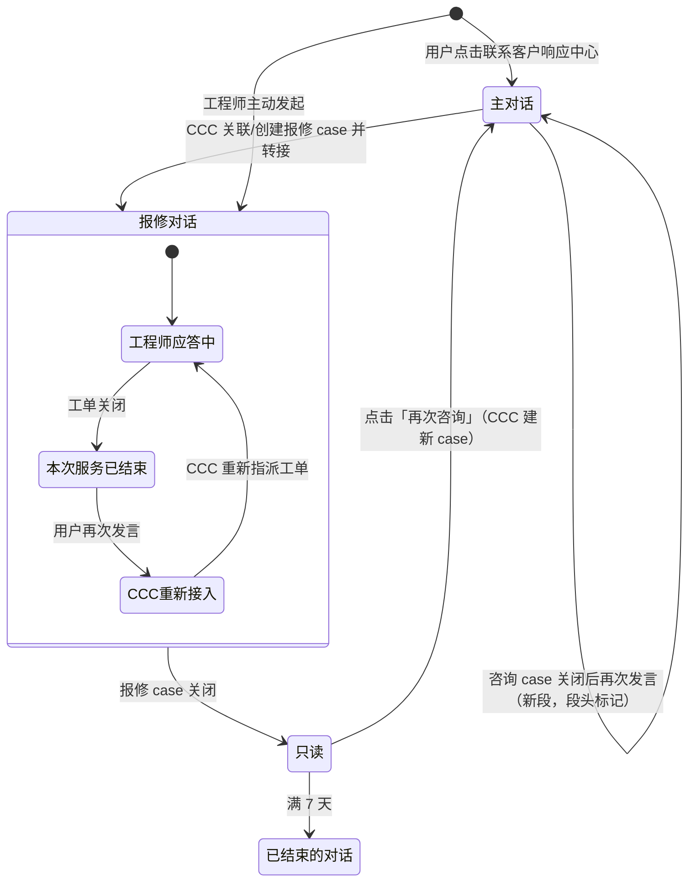

# 在线服务｜对话模型设计说明

> 范围：小程序「在线服务」下的全部图文沟通能力 —— 对话的**归属、分段、生命周期、展示与跳转**。
> 本文是对话相关需求的**唯一事实来源**。后续任何交互调整先改本文，再改代码。

状态标记见 [README.md](README.md)。

---

## 1. 领域模型：四个层级

对话不是一个独立实体，它永远**挂在某个 case 上**。理解对话前必须先理清四层关系。

```
设备 Device
  └── Case（服务事件）
        ├── 报修 case      在小程序中有记录、有详情页、有单号 D-xxxxxxxx
        └── 咨询 case      CCC 后台创建，小程序中【不作记录】、无详情页、用户不可见
              └── 工单 Work Order（服务派工）
                    └── 对话段 Segment（一段有人应答的沟通）
```

| 概念 | 定义 | 用户可见性 |
| --- | --- | --- |
| **Case** | 一次服务事件。CCC 后台一定会为每次服务建 case | 报修 case 可见；咨询 case 不可见 |
| **工单** | 挂在 case 下的派工记录。**工程师的服务是基于工单的** | 可见（工单列表/详情） |
| **对话段 Segment** | 一段有人应答的沟通。边界由 **case / 工单的状态**决定 | 不作为独立列表项，只作为流内的段头或分隔条 |
| **会话 Thread** | 用户在「我的对话」里看到的一个列表项 | 可见，是用户唯一感知的对话单位 |

### 1.1 关键判断（业务事实，不可改）

- **R1** 用户主动发起时，**一定先接入客户响应中心 CCC**，不能直接连工程师。
- **R2** 工程师（RSE）不是 7×24 服务，工单关闭后不能直接找回同一位工程师，必须重新经 CCC 指派。
- **R3** 转接远程服务工程师时，CCC **必然创建一个报修 case**。没有报修 case 就没有工程师服务。
- **R4** 非报修类的 case（咨询 case）在小程序中**不留记录**，只承载对话。
- **R5** 一个报修 case 下可以先后有**不同工程师**服务（因为基于不同工单），也可能**重新派到同一位**工程师；但**不会同时有两位工程师**与客户对话。
- **R6** case 级的对话，在该 case 的详情页里**一定能找到入口**。
- **R7** 分段的锚点是**工单状态**，不是工程师身份。即使前后是同一位工程师，工单关闭也必须分段 —— 目的是给用户**预期管理**：这位工程师现在已经不在线为我服务了。
- **R8** 咨询 case 由 **CCC 手动关闭**，无超时自动关闭机制。
- **R9** 报修 case 是否已解决，取决于 **case 自身的状态**，不由“工单是否全部关闭”推导。

---

## 2. 用户只看到两种会话

这是整个模型的核心简化。系统内部分段很复杂，但**用户视角只有两种 thread**：

| 用户看到的 Thread | 数量 | 内部按什么分段 | 段结束条件 | 标题 |
| --- | --- | --- | --- | --- |
| **主对话**（与客户响应中心） | 全局唯一，常驻，永不消失 | 咨询 case | 咨询 case 关闭 | 客户响应中心 |
| **报修对话** | 每个报修 case × 每个参与人 **一条** | 工单 | 工单关闭 | 设备名 · D-xxxxxxxx |

> 分段是**渲染层的段头 / 分隔条**，不是列表层的拆分。用户永远不会因为后台换了 case / 换了工单，而在「我的对话」里多出一条新记录。

> 一个报修 case 可能存在**多条**对话（不同人各自一条，见 §5.4），但对**单一用户**而言永远只有一条，不会因为换工程师而拆开。

### 2.1 为什么主对话必须永续

用户前后很可能在说同一件事。咨询 case 关闭后再次发起，对用户**必须无感** —— 不能清空、不能新建一条、不能弹「对话已结束请重新发起」。系统在后台惄惄开一个新的咨询 case。

> **“无感”的准确含义**：指**不需要用户做任何重新发起的动作**，不是“界面上看不到任何变化”。上一段结束、下一段开始时，仍需要一个**清晰的段头**让用户看懂分界（见 §5.2）。

---

## 3. 三条发起路径

### 3.1 路径 A：用户主动发起，问的是**已存在的 case**

```
用户点「联系客户响应中心」
  → 进入主对话，直接打字
  → 需要时用输入框旁的选择器关联设备 / 报修
  → CCC 判断后【跳转】到该报修 case 的对话，主对话流中留下一张跳转卡片
  → 后续由 CCC 应答；如需现场/远程处理，转接 RSE
```

- **A-1** 不做任何**意图猜测**：对话页不列「相关报修」建议卡片、不列「业务咨询」选项、不弹续保/报价表单。用户直接打字，上下文由输入框旁的关联选择器提供（B-1、B-2）。
- **A-2** 跳转在主对话流中留下一张**显著的卡片**（非灰字分隔条）：设备图标 + 设备名 + `模态 · 报修号` + 「查看对话 ›」，卡片上方一行灰字说明「本次咨询已转到报修对话」。用户回到主对话时，能看懂「这一段我转走了」。
- **A-3** 若 CCC 自己能答（不需要工程师），对话就停留在当前 thread，不转接。

### 3.2 路径 B：用户主动发起，问的是**不存在的 case**

```
用户点「联系客户响应中心」
  → 进入主对话，直接打字
  → 输入框旁提供「关联设备 / 关联报修」选择器（可选，用户自己决定发不发）
  → CCC 后台判断：
       需要工程师  → 创建报修 case → 转接 RSE → 【跳转】到报修对话
       不需要工程师 → 归入咨询 case → CCC 在主对话内直接回复
```

- **B-1** 设备/报修选择器**放在输入框区域**，不是必填前置步骤。用户可以不提供上下文就发问。
- **B-2** 关联信息以「附带卡片」形式随消息发出，用户发送前可取消。
- **B-3** 咨询 case 对用户完全透明：不显示 case 号、不进任何列表、无详情页。

### 3.3 路径 C：工程师主动发起（补充资料）

```
工程师需要客户补资料
  → 直接在对应报修 case 的对话中发起
  → 该对话出现在「我的对话」，未读提醒
```

- **C-1** 这类对话天然是**报修 case 类型**，不经过主对话。
- **C-2** 若该报修对话此前不存在，由此消息创建；用户第一次打开即看到工程师的消息。

### 3.4 路径 D：已关闭报修的再次咨询

```
用户打开一条已关闭 case 的报修对话（只读）
  → 底部「再次咨询」按钮
  → 跳转到主对话，并自动附带原报修单号作为上下文
  → CCC 判断后建立新的 case（可能是新的报修 case）
```

- **D-1** 这是**新对话**，不在原对话中续写（L6、Q6）。
- **D-2** 原报修单号作为附带卡片带入，用户仍可在发送前取消。

---

## 4. 生命周期

### 4.1 状态定义

| 层级 | 状态 | 判定来源 | 对用户的含义 |
| --- | --- | --- | --- |
| 工单 | 进行中 / 已关闭 | 工单自身状态 | 「本次服务」是否还在进行 |
| 报修 case | 未关闭 / 已关闭 | **case 自身状态**（R9） | 这件事是否彻底结束 |
| 咨询 case | 未关闭 / 已关闭 | **CCC 手动关闭**（R8） | 用户不可见 |

> 报修 case 的关闭**不**由「工单是否全部关闭」推导。可能出现「工单已全关但 case 仍未关闭」的中间态 —— 此时对话仍活跃，只是没有工程师在线。

### 4.2 两级结束：工单关闭 ≠ case 关闭

这是最容易做错的地方。**工单关闭只是暂停，case 关闭才是终止。**

| | 工单关闭（case 仍未关闭） | 报修 case 关闭 |
| --- | --- | --- |
| 对话流 | 插入分隔条「本次服务已结束」 | 插入结束段「本次报修已完成」 |
| 输入框 | **保持可用** | **禁用**，替换为「再次咨询」按钮 |
| 再次发言 | 留在**原对话**，CCC 接手并重新指派工单 | **不能**在原对话继续，跳转到主对话发起新咨询 |
| 后台动作 | 在原 case 下开新工单 | CCC 视情况建**新的 case** |

### 4.3 生命周期规则

- **L1** **工单关闭 → 分隔条「本次服务已结束」**，输入框保持可用。分隔条基于**工单状态**（R7），即使重新指派到同一位工程师也照常分段 —— 它传达的是「这位工程师现在不在线为我服务」的预期，不是「换人了」。
- **L2** 工单关闭后用户再次发言，**不直接接到原工程师**，由 CCC 接手并重新指派。应答方标记回到「客户响应中心」。
- **L3** **case 未关闭 → 对话保留在「我的对话」**，即使当前没有进行中的工单。
- **L4** **报修 case 关闭 → 对话转为只读**。关闭后在「我的对话」保留 **7 天**并标记「已结束」，之后移入「已结束的对话」。历史记录永久可查。
- **L5** 咨询 case 由 CCC 手动关闭。关闭后用户再次发言 **自动开启新的咨询 case**，用户无需任何重新发起动作；流内以**段头**（§5.2）标记新一段的开始。主对话**永远不会**被归档。
- **L6** **已关闭 case 的报修对话不可继续发言**（Q6）。底部提供「再次咨询」按钮 → 进入主对话，由 CCC 判断并建立新 case。原对话保持完整只读，可随时回看。
- **L7** 已结束的对话中，仍可查看全部历史消息与图片附件。

### 4.4 状态流转图



---

## 5. 展示规则

### 5.1 「我的对话」列表

页面结构是**一条常驻入口行 + 一组报修对话**，不是两个并列的类目。

| 区块 | 内容 | 形态 |
| --- | --- | --- |
| **客户响应中心**（主对话） | 全局唯一，常驻置顶 | **不带分组标题**，恒定一行，永不为空、不参与排序 |
| **报修对话** | **仅进行中**的报修，一个 case 一条 | 带分组标题，0~3 条 + 「全部报修对话（N）」入口 |

> **不要给第一块加分组标题。** 曾经叫「在线咨询」，与下方的「报修对话」构成一对反义词并排出现，业务方和用户都会读成「先选自己是咨询还是报修」——而事实恰恰相反：用户唯一能做的动作就是联系 CCC（R1），下面那组报修对话是系统受理报修后**替他建好的结果，不是可选项**。删掉这个标题后页面上只剩一个分组标题，层级自然成立：上面是入口，下面是清单。另外「在线咨询」与行标题「客户响应中心」（D9）本就不同名，同一条对话出现两个称呼，加上底部同样指向它的「联系客户响应中心」主按钮，用户会以为是三条不同的路。

> **两块行样式必须完全一致**，差异只体现在容器上（有无分组标题、块间 12px 间隙）。它们对用户是同一类对象——都有未读角标、消息预览、时间戳，点进去都是聊天。**不要弱化报修行**：那里躺着的恰恰是最紧急的未读（工程师在等现场照片），做小做灰等于把最需要响应的东西降权；也**不要给 CCC 行加 chevron**，它同时是一条消息条目，chevron 会与时间戳抢位并暗示「点进去不是聊天」。

| 规则 | 说明 |
| --- | --- |
| **D1** | 报修对话在**用户发过言**或**对方有后续跟进**（消息数 > 1）时才进入列表。仅由「进入报修详情」自动创建、只有一条欢迎语的对话不入列 |
| **D2** | CCC 转接到工程师后，该报修对话必然有 CCC 欢迎语 + 工程师接入，**一定会出现**在列表中 |
| **D3** | 报修完成/取消后，该对话**直接移出**在线服务页，收进「全部报修对话」的「报修已完成」分组。首页只留进行中的，不再有 7 天保留期 |
| **D4** | 主对话常驻第一行，不参与排序；报修对话组内**纯按最后消息时间倒序**（越新越靠上），因为组内已经只剩进行中的 |
| **D5** | 状态标签只标**需要用户注意的**：`服务中`（蓝）/ `等待重新安排`（橙，工单已关、case 未关）。**已完成的不打标签** —— 「已结束」会被误读成"对话结束了"，而它描述的其实是报修状态；改用**头像置灰**表达，把「服务中」高亮出来 |
| **D6** | **不显示工程师姓名**。工程师是谁对用户识别对话没有帮助，状态才有 |
| **D7** | 头像图标取**最后应答方**的身份，不是取当前开放段——已结束的对话没有开放段，按开放段取会错误地显示成客服 |
| **D8** | 头像统一由 `components/role-avatar.tsx` 渲染，列表与对话页**必须一致**：**工程师 = 飞利浦蓝圆底 + 白色 `PersonHeadset`**（与报修卡「已分配服务工程师」同一图标，远程服务工程师本就是戴耳麦做远程支持的人）；**客户响应中心 = `assets/icons/PHILIPS.svg`**（蓝底白 PHILIPS 字标的现成圆形头像，CCC 是**机构**不是某个具名人，用品牌标志表达「官方渠道」，参考微信服务号）；已完成对话把头像置灰（工程师用 muted 配色，品牌头像用 `grayscale`）。**两个角色共用同一个蓝色底**，只靠图形区分，不再分两种底色。**不要用 `PhilipsShield` 图标** —— 盾牌内部有波纹和星形细节，缩到 19–24px 完全糊成一团；**也不要用光秃的扳手代表工程师** —— 工具不是人，看不出是在和人对话 || **D9** | 标题规划：主对话固定「客户响应中心」（对话对象即标题，不叫「在线咨询」）；报修对话以 **case 本身为大帽子** —— 主标题「报修号：D-xxxxxxxx」，第二行辅助信息「设备名 · M月D日报修」帮用户对上号 |
| **D10** | 最后一条消息预览**限一行**，超出省略；未读**只用红色角标**表达，角标放在**标题行最右端**（不叠在头像上——叠在深蓝头像上很突兀；也不与预览文本同行），不给整行加底色（浅蓝底会被读成选中/高亮态，引起误解） |
| **D11** | 时间戳放在**预览行末尾**，不放标题行 —— 与未读角标分层后，有无未读都不会挤动时间列。**当日显示时间点**（18:50），非当日显示日期（5-22） |
| **D12** | 无论何种角色，列表中**只显示自己的对话**（P1）。他人对话只从报修详情页进入 |
| **D13** | 「常见问题」保持在对话之下。对话数量增长由 D 组的 3 条上限 + 完成即移出兜底，不会把常见问题挤出首屏 |

### 5.2 三级分段：段头、头像标记、分割线

分段是本模型**唯一**的复杂度出口。所有后台的 case / 工单切换，都只以三种视觉层级呈现，**不新增列表项、不清空历史**。

#### 一级：段头 Section Header（大 case 边界）

用于**咨询 case 之间**的边界 —— 即「上一件事已经了结，这是新的一件事」。

- 视觉：**60px 品牌头像**（`assets/icons/PHILIPS.svg`）+ `飞利浦客户响应中心` + 日期，横向居中，上下留白充足，**不带横线**。
- 目的：让用户一眼看出「这是新的一段咨询」，而不是误以为上文还在延续。
- 出现位置：主对话流中，每个咨询 case 的第一条消息之前，**包括首段**。

| 场景 | 段头文案 |
| --- | --- |
| 每一段咨询开始 | `飞利浦客户响应中心` + 日期 |

> **不要写「新的咨询」**。这是从系统视角描述后台的 case 切换，用户读不懂也不关心。改成「品牌头像 + 对话对象名 + 日期」，等价于微信服务号的会话头，既说明了「这是一段新会话」，也说明了「你在跟谁说话」。

#### 二级：头像标记（对接人变化）

对接人变化**不用分割线** —— 分割线会把一段完整的服务切碎。只用一个**居中的 48px 头像**（颜色与该角色一致）+ 一行灰字说明：

| 触发时机 | 文案 |
| --- | --- |
| 转接远程服务工程师 | `远程服务工程师 周工 已接入` |
| 转回客户响应中心 | `已转回客户响应中心` |

#### 三级：分割线 Divider（**只用于一段完结**）

带左右横线的居中灰字，**全应用内仅三种文案**：

| 触发时机 | 文案 |
| --- | --- |
| 工单关闭，报修还在进行 | `本次服务已结束` |
| 报修 case 关闭（对话终止） | `本次报修已完成，对话已结束`（加重分割线） |
| 主对话的咨询段关闭（用户自己点结束，见 H7） | `本次咨询已结束` |

- **E1** 段头、头像标记、分割线**都不是消息气泡**，不带时间戳、不计入未读。
- **E2** 文案必须简短、陈述事实，不解释机制、不揣测用户意图。
- **E3** 分割线基于**工单状态**触发（R7）。即使重新指派到同一位工程师，工单关闭仍然出分割线。
- **E4** **不向用户暴露新工单**：不出现「新的服务安排 · 工单 W…」这类后台安排。工单是内部调度对象，且新工单本来就是 CCC 重新安排的结果 —— 那句 CCC 消息本身已经把事情说清楚了。工单关闭后的新段直接接着消息流往下走。
- **E5** case 关闭的结束分割线用**更深的线与文字**（`#c9ced6` / `#6a7282`）与普通分割线区分；底部按钮区因此**不再重复**「本次报修已完成」标题。

### 5.2.1 对话页气泡与身份

- **G1** 对话对象**只在顶部说明一次**：报修对话在 case 条下方常驻一条 `当前对接 · 远程服务工程师 周工` 的身份条（对话已结束时文案为「本次对接」、头像转灰）；主对话由导航标题 `客户响应中心` 承担同一职责。**消息气泡上不再逐条重复发送者姓名**。
- **G2** 对话中途的身份变化由头像标记承担（见 5.2 二级），身份条同步反映最新对接方。
- **G3** 气泡颜色用 Filament 默认：收到 = 灰底，发出 = 蓝底。**不要把收到的气泡也改成蓝色** —— 两侧同色会让整段对话粘在一起。
- **G4** 气泡宽度必须成对齐：收到 `calc(76% + 40px)`（含 40px 头像栏），发出 `76%`，两侧气泡的实际折行宽度一致。禁止让气泡撑满整行。
- **G5** **不显示已读状态**（ChatBubble 的 `status` 一律不传）。「对方是否已读」不是客户关心的信息，也无法保证准确。
- **G6** 发送失败的消息在气泡左侧显示红色 `ErrorFill` 感叹号（`#d5233b`），点击即重发（`retryMessage`）。消息的 `deliveryStatus?: 'sent' | 'failed'` 是唯一的失败标记。
- **G7** 对话页**不做任何意图猜测**（参 A-1）：不推荐「相关报修」、不猜用户要问什么、不放续保/报价表单。但**允许一个用户主动点选的入口菜单**，见 5.2.2。

### 5.2.2 新会话开场：欢迎语 + 预设入口卡

一段新的咨询开始、且用户**还没说第一句话**时，主对话给出固定的开场组合（`QuickEntryCard`）：

1. **欢迎语气泡**（CCC）：`您好，这里是飞利浦客户响应中心，7×24 小时为您服务。客户响应中心正在为您接入，请稍作等待。`
2. **预设入口卡**，两级，永远由用户自己点。提示语一句话说清「这是干什么的 + 选了有什么好处」：`您想咨询什么？选一项可更快为您接入对应人员，也可以直接在下方描述问题`
   - 一级三项（**动词「咨询」只出现在提示语里，选项本身只留名词**，选项越短越好点）：
     - `报修中设备` — `N 个进行中的报修 · 查进度 · 催单`（仅当存在进行中的报修时出现）
     - `已有设备` — `合同保养 · 使用问题 · 培训`
     - `新设备` — `采购报价 · 合同与续保 · 演示与培训`
   - 二级 · 报修中设备：列出所有进行中的报修，**报修号单独作为标题**（`报修号：D-12126615`），副行是 `设备名 · 当前节点`。用户来问的十有八九是「我那单到哪了」，报修号是他手上唯一能对上的凭据，不能埋在副行里。
   - 二级 · 已有设备：列出**全部**设备（不是前几台），返回行标注总数 `选择设备（13）`，列表 `maxHeight: 268` 内滚动。**禁止 `slice(0, N)`** —— 用户在设备页看到十几台，这里只给 5 台会显得系统认不全他的设备。每行副行必须带**设备编号**（`EQ 2093760 · 科室 · 位置`，无 EQ 时降为 `SN xxx`）—— 同型号设备常常不止一台，光靠型号选不准。
   - 选中后发出的那句话也要带编号：`我要咨询 Azurion M3（EQ 2093760）`，否则工程师在历史记录里也分不清是哪一台。
   - 选中设备或报修单后 CCC **直接推卡片**，前面不加「已为您调取该设备的当前状态：」这类过场白 —— 卡片本身已经说明了一切，多一句话只是拖慢节奏。卡片之后跟一句「客户响应中心正在为您接入，请稍作等待。」
   - 二级 · 新设备：`采购报价` / `合同与续保` / `产品演示` / `培训与验收` / `其他` 五个 chip，选中后 CCC 回执 + 排队提示。

- **H1** 这**不是意图猜测**。区别在于：猜测是系统替用户决定他要问什么；这里是用户**自己点**，系统只负责把他点的东西变成一句话发出去。
- **H2** 入口卡只在「本段已开启 + 本段还没有用户消息」时出现，用户一旦点选或直接打字，卡片自然消失，不需要关闭按钮，也不会残留在历史里。
- **H3** 卡片右上角**不要加关闭按钮**，也不要让它变成常驻菜单栏 —— 它是一次性的开场，不是功能入口。但入口卡消失后必须有**另一条路回到它**，见 H6。
- **H6** **选错了要能重选**。输入框**上方固定一条操作条**（不是藏在输入行里的图标按钮 —— 那样会把输入框挤得太小，也不好发现），「选择设备或报修单」胶囊按钮展开后是同一张 `QuickEntryCard`。面板里**不写提示语** —— 用户主动点开的东西不需要再解释一遍；右上角给一个 `×` 关掉。重选不撤回旧卡片，只是再推一张新的 —— 删消息会让历史对不上。仅主对话（`scope === 'general'`）提供；报修对话的对象是固定的，不给重选。
- **H7** **用户可以自己结束咨询**。「结束咨询」紧跟在「选择设备或报修单」后面，**用同一种胶囊样式、同等分量** —— 写成右侧的灰字链接根本看不见。只在主对话且**本段已经有用户消息**时出现 —— 一句话还没说就结束是无意义的。确认后调 `closeActiveSegment`，插入分割线「本次咨询已结束」（`SegmentDivider` 的第三句固定文案）。**结束后不锁输入框** —— 用户再发一句就自动开新一段，带新的段头。
- **H4** **信息卡片**（`DeviceSummaryCard`）分两种形态，字段按「用户此刻真正关心什么」裁剪，不是把设备详情页搬过来：
  - **报修形态**（从报修单进入，带 `caseId`）：报修号 / 当前进度（节点 + 日期）/ 服务工程师 / 报修时间，底部 `查看报修详情 ›` 跳报修详情页。**不显示服务合同和下次保养** —— 单子还在处理中，这两项跟当下的问题无关。
  - **设备形态**（从设备进入）：报修进度（**仅当该设备有进行中的报修时才出现**，没有就整行不显示，不要写「当前无进行中的报修」这种废话）/ 服务合同（**仅授权用户可见**）/ 下次保养（有计划才显示）/ 设备编号，底部 `查看设备详情 ›` 跳设备详情页。
  - **权限**：认证用户看不到任何合同信息（设备详情页对他也没有「合同」Tab），卡片必须跟着一起隐藏，不能因为是聊天里的卡片就漏掉权限判断。
  - 卡片整体是一个可点按钮，**必须能点进详情**；只读的信息卡在对话里是死路一条。
- **H8** **状态标记只标异常**。卡头不再放单一状态 Tag；「正常运行」**不显示**（没毛病不需要占一个色块），只在有特殊状态时给一排小 chip。这排 chip 必须与**设备详情「总览」里标出来的状态卡完全一致**（停机 / 待验收 / 报修中 / 即将出保 / 无保 / 保养风险 / 本月保养），且遵守同一套权限门禁（待验收 / 即将出保 / 无保 仅授权用户）。**判定逻辑必须只有一份**：`utils/device-status-flags.ts`，设备详情页和卡片都从它取，不允许各算各的。
- **H9** **服务合同那一行不能直接印 `businessContract` 字段**。字段只是合同类型，不等于当前是否在保 —— 一台待验收设备 `businessContract` 也可能是 `warranty`，直接印就变成「已在保」的误导。必须走 `contractSummaryOf(device)`，它复用合同 Tab 状态卡的同一套优先级：待验收 → 装机不足 6 个月（合同信息录入中）→ 无合同记录 → 已到期 → 在保/即将出保。
- **H5** 三种卡片（`TransferCard` / `DeviceSummaryCard` / `QuickEntryCard`）视觉必须是同一族：白底、`#dce3ec` 描边、12px 圆角、**通栏宽度**，左右都贴着消息流的 16px 内边距。**信息卡不能塞进 `receivedBubble`** —— 那个容器是 `align-self:flex-start` + 40px 头像栏，卡片会被挤到左边显得没对齐。

### 5.3 跳转与回溯

- **F1** 主对话中的跳转以**卡片**呈现（见 A-2），不是灰字分隔条 —— 灰字太不显眼，用户会漏掉。
- **F2** 报修对话顶部常驻 case 条：显示 `设备名` + `单号 · 状态`，提供两个入口 —— 报修详情、设备详情。
- **F3** 报修 case 详情页必须有「查看对话」入口（R6）。
- **F4** 从任意入口进入同一个报修 case 的对话，看到的是**同一条**连续的流。

### 5.4 数据权限：授权用户能看到什么

授权用户（admin）**不是**「能看到所有对话」，权限被严格收窄：

| 规则 | 说明 |
| --- | --- |
| **P1** | 「在线服务 → 我的对话」列表中，**只显示自己的对话**。授权用户与认证用户在此页表现完全一致 |
| **P2** | 授权用户**只能**看到**报修 case 级**的他人对话。主对话、咨询内容一律不可见 |
| **P3** | 查看他人对话的入口**仅限报修详情页**，不出现在任何列表页 |
| **P4** | 他人对话必须**标记清楚参与双方**，例如「张三 ↔ 周工（服务工程师）」，避免误以为是自己的记录 |
| **P5** | 他人对话对授权用户**只读**，不能在其中发言 |
| **P6** | 授权用户可以就同一个报修 case **另起一条自己的对话**，**不与他人对话合并**。同一 case 下因此可能并列多条对话 |

> 因此报修详情页的「对话」区域是一个**列表**（可能 0~N 条），而不是单一入口。自己的那条置顶并可进入发言；他人的按参与人罗列，进入后只读。

**P7 报修详情页不展示对话内容，只给一个入口。** 入口是「服务工程师」小节**标题行最右侧**的蓝色文字链「服务对话 ›」（多于一个时写「服务对话（N）」）—— 页面上不放对话列表，也不放最后一条消息预览，那是集合页的事。点进去是 `CaseConversationsPage`（导航标题「服务对话」+ 设备名/报修号副头），里面才是对话集合。行标题只写归属：自己的叫「我的对话」，他人的叫「X 的对话」+ 只读标签；工程师是谁上一页已经写了，不在每行重复。报修已结束、页面上没有工程师通道时，同一个入口单独成一小节。

**P8 4/18 之前的报修（`isPreCutoffRepair(record)`）没有服务对话入口。** 小程序 2026-04-18 才上线，那之前根本不存在图文沟通，给一个空入口只会让用户白点一下。对话种子数据也不得挂在这类 case 上。这类页面上的「请联系客户响应中心」直接跳通用对话并自动带上 case，**不要**用 `ensureRepairConversation` 凭空造一条报修对话（详 [data-migration.md](data-migration.md#42-报修记录合并)）。

**P9 已结束报修的「还有疑问」入口要弱。** 这是低频场景，不配占一张带插图和主按钮的卡片，更不能放在页面顶部。改为页面**最底部**一行居中小字：「对这次报修仍有疑问？联系客户响应中心」。

---

## 6. 与当前原型实现的差距

> 本节列出的差距已在 v6 完成实现，保留作为变更记录。

| 项 | 改造前 | 目标 | 状态 |
| --- | --- | --- | --- |
| 主对话永续 | `conv-general` 可被归档 | 永不归档，永不消失 | 已实现 |
| 咨询 case 分段 | 无此概念 | 主对话内部按咨询 case 分段，边界用大 Pictogram 段头 | 已实现 |
| 工单分段 | 无此概念，`closedSummary` 只记一次关闭 | 报修对话内部按工单分段，可多段 | 已实现 |
| 分段锚点 | `conversation-handoff.ts` 按**应答方身份变化**推导分隔条 | 改为按**工单状态**推导（R7），同一工程师复派也要分段 | 已实现（handoff 降为段内转接标记） |
| 工单关闭提示 | 有 `本次服务已结束` 文案但非分段语义 | 作为分隔条插入，输入框保持可用（L1） | 已实现 |
| case 关闭 → 只读 | 归档对话仍可发言 | 输入框禁用，替换为「再次咨询」按钮（L6） | 已实现 |
| 关闭后再发言 → CCC 重新接入 | 无 | L2 | 已实现 |
| 主对话 → 报修对话的跳转记录 | `attachCaseContext` 只加一条系统消息，不跳转 | 分隔条 + 跳转入口（F1） | 已实现 |
| 输入框旁的关联选择器 | 关联入口在对话顶部引导卡片 | 移到输入框区域，可随消息发送/取消（B-1、B-2） | 已实现 |
| case 详情页「查看对话」入口 | 报修详情有 `service-entry-card` | 改为**对话列表**（0~N 条），支持他人只读对话（P3~P6） | 已实现 |
| 授权用户权限 | 无差异，全量数据 | P1~P6 | 已实现（列表过滤 + 页面硬拦截） |
| 对话归属人 | `Conversation` 无参与人字段 | 增加 `ownerId` / `participants`，支撑 P1、P4 | 已实现（`ownerId` + `ownerName`） |
| 应答方展示 | 有 `SENDER_LABEL` 与 handoff 推导 | 保留，扩展到列表项副标题（D5） | 已实现 |
| 7 天保留 + 已结束标签 | `conversation-grouping.ts` | 保留 | 已实现 |

### 6.1 已实现的数据结构

```ts
// Conversation 持有 segments，segment 决定应答方与结束态
// 实现位置：src/types/conversation.ts

type SegmentKind = 'inquiry' | 'work-order';

interface ConversationSegment {
  id: string;
  kind: SegmentKind;
  caseId: string;              // 咨询 case 或报修 case
  workOrderNo?: string;        // kind === 'work-order' 时填写
  engineerName?: string;       // 本段的远程服务工程师
  status: 'open' | 'closed';
  startedAt: string;
  closedAt?: string;
  messages: ConversationMessage[];
}

interface Conversation {
  id: string;                   // general = conv-general；repair = conv-<caseId>--<ownerId>
  scope: 'general' | 'repair';  // general = 主对话（每人唯一），repair = 每个报修 case × 每人一条
  caseRef?: CaseRef;            // scope === 'repair' 时必填
  ownerId: string;              // 发起并可在其中发言的人，支撑 P1 / P5
  ownerName: string;            // 用于 P4 的「张三 ↔ 周工」标记
  segments: ConversationSegment[];
  createdAt: string;
  updatedAt: string;
}
```

- 会话是否「已结束」不存在 `status` 字段，而是**由 caseRef 对应 case 的状态推导**（R9），集中在 `src/utils/conversation-status.ts`。
- 主对话 (`scope: 'general'`) 永远没有结束态。
- 段头（一级）出现在 `kind === 'inquiry'` 的 segment 之间；分隔条（二级）出现在 `kind === 'work-order'` 的 segment 之间。

---

## 7. 已确认的关键决策

以下 6 条已由业务方拍板，**不再是开放问题**。

| # | 问题 | 结论 | 落到规则 |
| --- | --- | --- | --- |
| Q1 | 咨询 case 由谁关闭？ | **CCC 手动关闭**，无超时自动关闭 | R8、L5 |
| Q2 | 复派是否可能是同一位工程师？分隔条依据什么？ | **可能是同一位**。分隔条一律基于**工单状态**，不基于工程师身份 —— 目的是给用户「这位工程师现在不在线服务我」的预期 | R7、L1、E3 |
| Q3 | 报修 case 关闭信号取自哪里？ | 取自 **case 自身状态**，不由工单是否全关推导 | R9、4.1 |
| Q4 | 主对话内的咨询 case 边界要不要显示？ | **要显示**。上一段大 case 结束、下一段开始时，用**较大的 Pictogram 段头**区分 | 5.2 一级段头 |
| Q5 | 授权用户能看到别人的对话吗？ | **仅限报修 case 级**，入口**仅限报修详情页**，需标注参与双方，**只读**；可另起自己的新对话但**不合并**；「我的对话」只显示自己的 | P1~P6 |
| Q6 | 已关闭报修还能继续对话吗？ | **不能**。应作为**新对话**发起，因为 CCC 会建立新 case | L6、4.2 |

### 7.1 仍待确认

| # | 问题 | 影响 |
| --- | --- | --- |
| Q7 | 段头的 Pictogram 用哪一个？`person-headset` 还是按咨询主题区分？ | 5.2 视觉 |
| Q8 | 授权用户在报修详情页看到他人对话时，是否需要脱敏（如隐藏联系电话）？ | P4 合规 |
| Q9 | 同一 case 下多人对话时，工程师侧是否会看到合并视图？影响用户对「工程师是否已知晓」的预期 | P6 |

---

## 8. 原型演示注意事项

原型使用 Zustand + `localStorage` 持久化，**刷新不会重置数据**。

- 顶部演示条右侧的 **「重置数据」** 按钮会清空全部本地演示数据并重新加载。
- 修改 `src/utils/conversation-data.ts` 中的种子数据后，需要**同时递增** `CONVERSATION_SEED_VERSION`，旧的本地数据才会自动失效。
